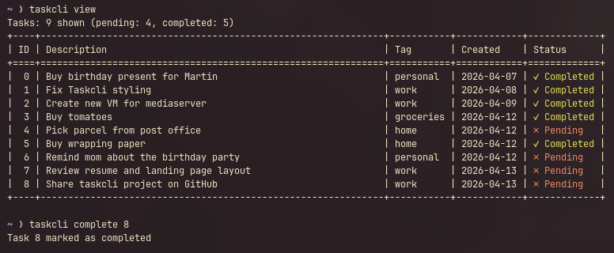
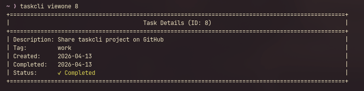
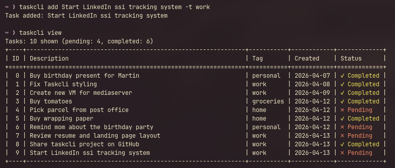
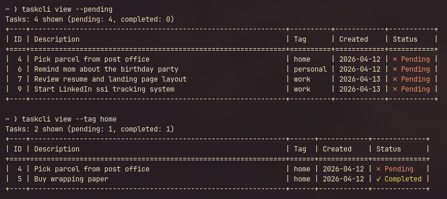

# taskcli

Simple CLI task manager written in Python.

## Features

- Add tasks with a description and optional tag/category.
- List tasks (all / pending / completed) and filter by tag.
- View details for a single task by ID.
- Mark tasks as completed.
- Delete tasks (with a confirmation prompt).
- Stores your tasks in a local file under your home directory.





## Requirements

- Python `>=3.10`

## Installation (recommended): pipx

`pipx` installs CLI apps in isolated virtual environments and exposes the app on your `PATH`.

### Install from PyPI (if published)

```bash
pipx install taskcli
```

### Install from a local checkout

This repo includes a `Makefile` with `pipx` install helpers.

```bash
make install
```

Other useful targets:

```bash
make reinstall
make uninstall
make clean
```

Notes:

- The `Makefile` installs in editable mode (`pipx install --editable .`).
- You can override the `pipx` state directory (useful for CI/sandboxed environments):
  - `make install PIPX_STATE_DIR=/tmp/taskcli-xdg-state`

From the repository root:

```bash
pipx install .
```

For editable/development installs:

```bash
pipx install --editable .
```

### Upgrade / uninstall

```bash
pipx upgrade taskcli
pipx uninstall taskcli
```

## Usage

After installation, run:

```bash
taskcli --help
```

### Commands

#### Add a task

```bash
taskcli add buy milk and bread
taskcli add "Buy milk and bread" --tag Home
taskcli add "fix bug #123" -t Work
```







Notes:

- The description is captured as “all remaining words”, so quotes are optional.
- If you don’t pass `--tag/-t`, the default tag is `General`.

#### View tasks

```bash
taskcli view
taskcli view --pending
taskcli view --completed
taskcli view --tag Home
```

Flags:

- `--pending`: show only tasks without a completion date
- `--completed`: show only tasks with a completion date
- `--tag TAG`: filter by a specific tag (case-insensitive)

#### View one task

```bash
taskcli viewone 2
```

#### Complete a task

```bash
taskcli complete 2
```

#### Delete a task

```bash
taskcli delete 2
```

Deletion requires a confirmation prompt. You must type `DELETE` to proceed.

## Data storage

Tasks are stored as CSV at:

- `~/.taskcli/tasklist.csv`

This file is created automatically the first time tasks are saved.

### CSV format

Each row is:

1. `id` (integer)
2. `description`
3. `tag`
4. `insertion_date` (`YYYY-MM-DD` or `Unknown`)
5. `completion_date` (`YYYY-MM-DD`, empty, or `Unknown`)

If you edit the CSV manually and some fields are missing/corrupt, `taskcli` tries to recover:

- IDs are remapped if missing/invalid/duplicate.
- Required text fields may be treated as `Unknown`.
- Dates may be treated as `Unknown` if they can’t be parsed.

## Running without installing

From the repository root:

```bash
python -m taskcli.taskmanager --help
python -m taskcli.taskmanager add write docs -t Work
python -m taskcli.taskmanager view --pending
```

## Project layout

- `pyproject.toml`: package metadata + CLI entry point (`taskcli`)
- `taskcli/taskmanager.py`: CLI argument parsing + command dispatcher
- `taskcli/classes/Task.py`: `Task` data model
- `taskcli/classes/TaskList.py`: persistence + task operations

## Notes

- Output uses ANSI color codes for status (`Pending`/`Completed`). If you redirect output to a file, you may see escape codes.

## License

MIT (see `LICENSE`).
